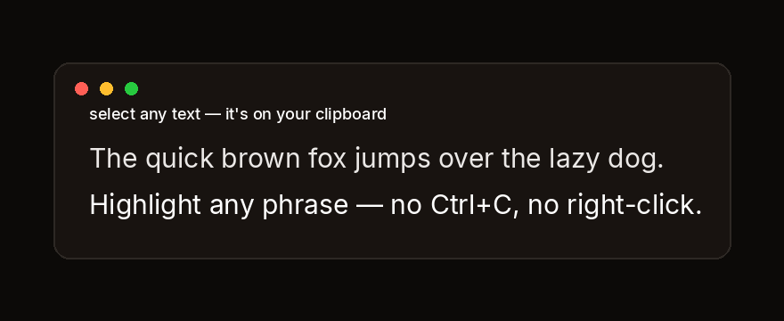

<p align="center">
  
</p>

<h1 align="center">Pluks — Select text. It's already copied.</h1>

<p align="center">
  Auto-copies any text you select — no Ctrl+C, no right-click. Free, tiny, open source.
</p>

<p align="center">
  <a href="https://github.com/darth-pixit/pluck-app/releases/latest"></a>
  <a href="https://github.com/darth-pixit/pluck-app/releases/latest"></a>
  <a href="https://github.com/darth-pixit/pluck-app/releases/latest"></a>
  <br>
  <a href="https://github.com/darth-pixit/pluck-app/releases/latest"></a>
  <a href="./LICENSE"></a>
  <a href="https://pluks.app"></a>
</p>

## Features

- **Auto-copy on selection** — highlight text anywhere and it's on your clipboard.
- **Searchable history** — last 200 clips, kept locally.
- **Local-first** — clipboard data never leaves your device.
- **Anonymous, opt-out telemetry** — usage stats help us improve; turn it off in preferences.
- **Cross-platform** — macOS, Windows, Linux.

## Repository layout

| Path | What's in it |
| --- | --- |
| [`app/`](./app) | Desktop app — Tauri 2 + React 19 + TypeScript + Vite. Includes the system-tray history panel, preferences, activation tour, and updater. |
| [`extension/`](./extension) | Browser extension (Chrome, Manifest V3) — select-to-copy in the browser with popup history. |
| [`website/`](./website) | Marketing site served at [pluks.app](https://pluks.app). Static HTML/CSS/JS with an interactive demo. |
| [`scripts/`](./scripts) | Release signing setup, analytics digest, and lead-handling helpers. |
| [`tests/`](./tests) | Manual release regression test plan. |
| [`.github/workflows/`](./.github/workflows) | CI: tests, release builds, website deploy, daily analytics digest. |

## Getting started

### Desktop app

```bash
cd app
npm install
npm run tauri dev      # dev build with hot reload
npm run build          # production build
npm test               # vitest unit tests
```

### Website

```bash
cd website
npm install
node serve.mjs         # local preview
npm test               # playwright tests
```

## Privacy

Pluks stores clipboard history locally and never transmits it. Optional anonymous product analytics (PostHog) and crash reports (Sentry) can be disabled from desktop preferences. See [`website/privacy.html`](./website/privacy.html) for the full policy.

## License

[MIT](./LICENSE)
